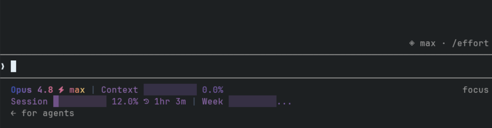
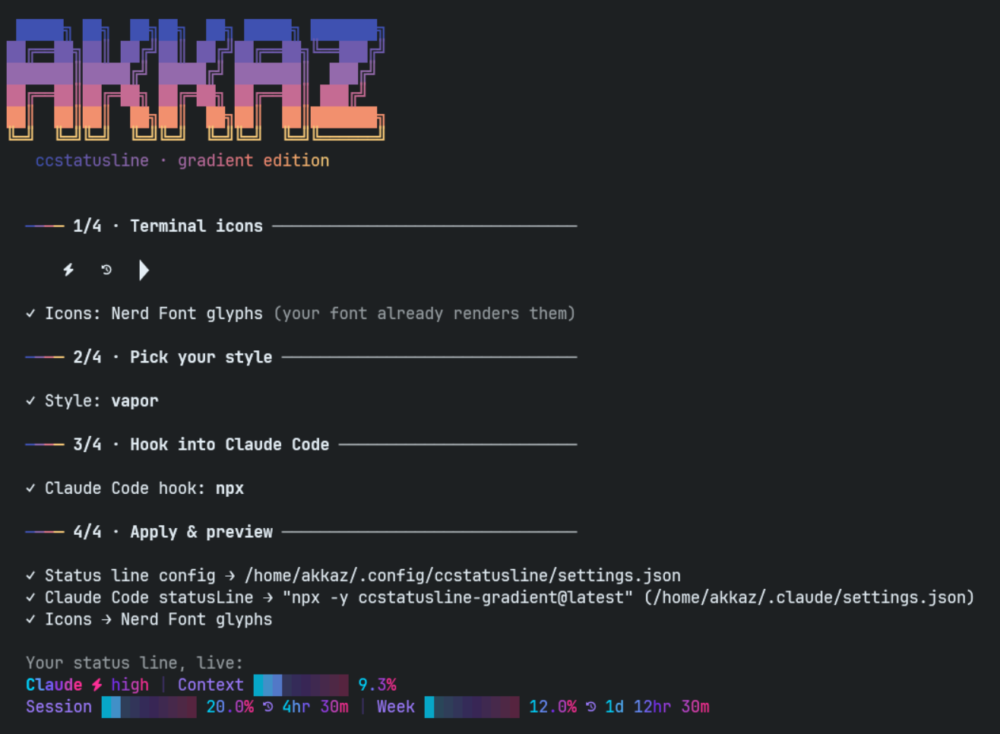

<div align="center">

# ccstatusline-gradient

**A richer status line for Claude Code — with true gradients and value-driven dynamic colors.**

Shows your model, thinking effort, context usage, session/weekly limits, reset timers and more — and paints them with smooth color gradients that even shift by value (green when low → red when full).



</div>

## Install — one command

On a fresh machine or SSH box, this sets up **everything** in four guided steps — one choice at a time, arrow keys, live previews:

```bash
npx -y ccstatusline-gradient@latest --onboard
```



1. **Terminal icons** — it shows you three test glyphs and asks what you see. Boxes or `?` marks? Pick **universal symbols** (plain Unicode, works with any font — no install) or have it download the **JetBrainsMono Nerd Font** for the real icons.
2. **Pick your style** — **↑/↓** through every built-in preset with a **live preview** of each (rendered with the icons you chose in step 1). None fit? Pick **Full configurator** to jump straight into the TUI.
3. **Hook into Claude Code** — choose `npx` or `bunx` for the `statusLine` command, or skip and wire it yourself.
4. **Apply & preview** — config written, your actual status line rendered on the spot.

Then **restart Claude Code**. That's it.

- First time running plain `npx -y ccstatusline-gradient@latest` with no config yet? The same wizard starts automatically.
- Know what you want? Skip the style picker: `--onboard --preset ferro`.
- Piped/scripted runs (no TTY) skip all questions: default preset, `npx` wiring, best-effort font install (`--no-font` to skip).
- **Esc** at any step quits without changing anything.
- If you install the Nerd Font, remember the one manual step it can't do for you: **select "JetBrainsMono Nerd Font" in your terminal's settings** (the wizard prints the exact menu path for your terminal).
- Your existing `~/.claude/settings.json` keys are preserved; the previous ccstatusline config is backed up.

## Configure it (interactive TUI)

Run the same command **without** `--onboard` to open the configuration UI — add/remove widgets, reorder them, and pick colors:

```bash
npx -y ccstatusline-gradient@latest
```

In the color menu, press **`g`** for a gradient or **`y`** for a dynamic (value-based) color.

> Want to point Claude Code at it manually? Add to `~/.claude/settings.json`:
> ```jsonc
> { "statusLine": { "type": "command", "command": "npx -y ccstatusline-gradient@latest" } }
> ```

> No Nerd Font in your terminal? Set `"iconMode": "unicode"` in `~/.config/ccstatusline/settings.json` and every Nerd Font glyph (preset badges, powerline arrows, widget icons) is swapped for a plain-Unicode equivalent at render time — no more ⍰ boxes.

## The colors

This fork adds two things on top of [ccstatusline](https://github.com/sirmalloc/ccstatusline)'s named / `ansi256:N` / `hex:RRGGBB` colors:

**1. Gradients** — set a widget's `color` to a gradient and it sweeps across the text, character by character:

```jsonc
{ "type": "model", "color": "gradient:vice" }            // a named preset
{ "type": "model", "color": "gradient:5ee7df-b490ca" }   // custom stops (2+ hex colors joined by -)
```

Presets: `atlas, cristal, teen, mind, morning, vice, passion, fruit, instagram, retro, summer, rainbow, pastel`.

**2. Dynamic (value-based) color** — add the `dynamic: true` flag to a *value* widget and give it a `gradient:` ramp. Instead of spreading the gradient across the text, the widget picks **one** color from the ramp based on its current value (0 → 100%):

```jsonc
{ "type": "context-bar", "color": "gradient:22c55e-eab308-ef4444", "dynamic": true }
// green when low → yellow → red as it fills
```

Works on the widgets that report a value: **context-bar, context-percentage, session-usage, weekly-usage, reset-timer**.

> **Continuous gradient across several widgets:** split the stops so each widget *ends* on the color the next one *begins* with. E.g. for `Opus 4.8 ⚡ high`:
> ```jsonc
> { "type": "model",          "color": "gradient:3f51b1-cc6b8e" }        // start → seam
> { "type": "custom-text",    "color": "hex:cc6b8e", "customText": "⚡" } // the seam
> { "type": "thinking-effort","color": "gradient:cc6b8e-f7c978" }        // seam → end
> ```

Truecolor (`colorLevel: 3`) is recommended; at 256-color the gradients degrade gracefully, at 16-color they fall back to a solid first stop.

## Presets

Seven **signature presets** ship in the package — run `--onboard` to pick one from the live preview, or `--onboard --preset <name>`. Three are gradient; the rest are sober solid-color looks, each with a thematic Nerd Font badge:

| Preset | Gradient? | Look |
| --- | :---: | --- |
| **`akkaz`** *(default)* | ✅ | Retro **indigo → amber** identity row (`model ⚡ effort`); context/session/weekly bars colored **dynamically** by usage; reset timers tracking their bar; compaction counter (`⊟ compact N`). |
| **`barocco`** | ✅ | Italian tricolore — **green → white → red**. |
| **`vapor`** | ✅ | Synthwave **cyan → magenta** neon. |
| **`inchiostro`** | — | Ink on paper ✎ — solid **monochrome**, one cyan accent. |
| **`carbonara`** | — | Warm & cozy  — egg-yellow + pancetta tones. |
| **`ferro`** | — | Brushed steel  — cool gray-blue, calm and professional. |
| **`bosco`** | — | Forest  — solid greens, quiet and natural. |

Drop-in JSON configs also live in [`presets/`](./presets) — copy one straight into `~/.config/ccstatusline/settings.json`:

```bash
mkdir -p ~/.config/ccstatusline
curl -fsSL https://raw.githubusercontent.com/akkaz/ccstatusline-gradient/main/presets/retro-dynamic.json \
  -o ~/.config/ccstatusline/settings.json
```

| File | Look |
| --- | --- |
| `retro-dynamic.json` | 3 lines, retro gradient identity row + dynamic green→red bars. Subscription-friendly (no cost/git). |
| `vibrant.json` | 2 lines. Vice gradient on the model, dynamic context, session + reset. |
| `minimal.json` | 1 line. Model gradient + dynamic context bar only. |

## Build from source (optional)

Only needed if you change the TypeScript. Uses [Bun](https://bun.sh):

```bash
bun install
bun run build      # -> dist/ccstatusline.js
bun run start      # open the TUI
bun test           # run the test suite
```

## Credits & license

A community fork of **[ccstatusline](https://github.com/sirmalloc/ccstatusline)** by [@sirmalloc](https://github.com/sirmalloc) (Matthew Breedlove) — all the core widgets, docs and functionality come from upstream, so please star it too. This fork only adds the gradient + dynamic-color layer.

MIT, © 2025 Matthew Breedlove. New code contributed under MIT as well.
